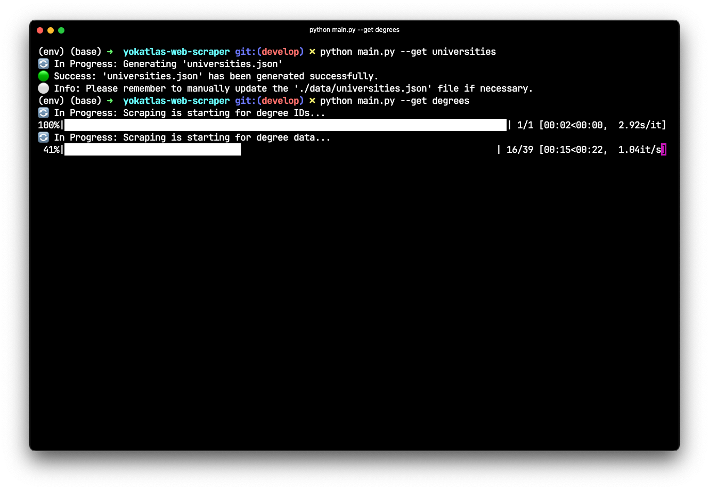
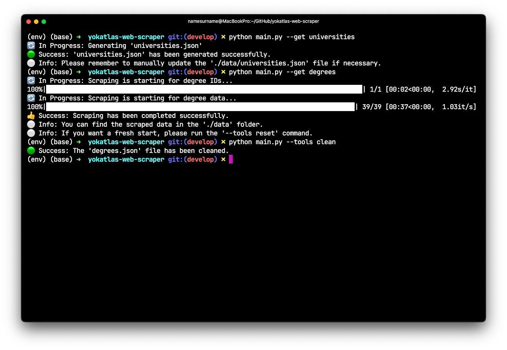
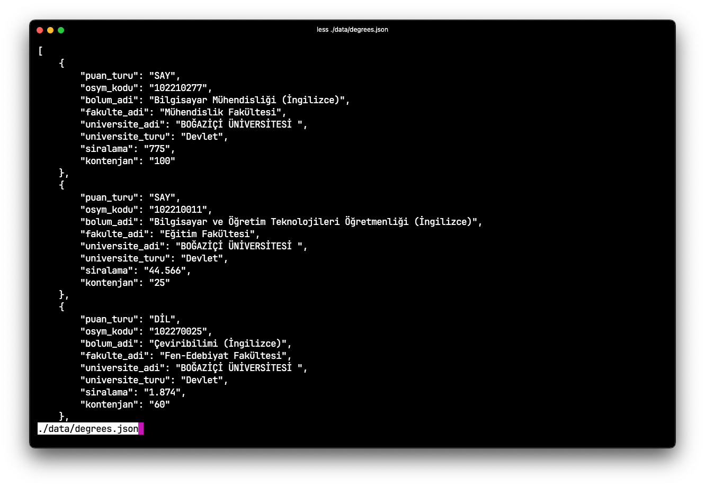

## YokAtlas Web Scraper

- A web scraper using **Python**, **BeautifulSoup** and **Selenium** to extract bachelor's degree program details from Turkish universities.

### 1. Preview

<div style="float: left;">
    
    
    
</div>

### 2. Warning

This project is for `educational use only` and carries no liability.

### 3. Installation

Ensure you have `Python 3.x`, `pip`, `virtualenv` and `chromedriver` installed on your system.

1. **Clone the repository.**

```sh
git clone https://github.com/otegecmis/yokatlas-web-scraper.git
```

2. **Navigate to the project directory.**

```sh
cd yokatlas-web-scraper
```

3. **Run the installation script.**

```sh
./scripts/install.sh
```

4. **Activate the virtual environment.**

```sh
. env/bin/activate
```

### 4. Run Instructions

1. **First, fetch the list of universities.**

```sh
python main.py --get universities
```

If needed, you can manually edit the list of universities by modifying the `universities.json` file located in the `data` folder.

2. **Next, fetch the list of degree programs offered by these universities.**

```sh
python main.py --get degrees
```

3. **Perform the clean operation.**

```sh
python main.py --tools clean
```

4. **After the clean operation, you can view the list of degrees.**

```sh
less ./data/degrees.json
```

Refer to the `Usage` section below for more available commands. 🥳

### 5. Usage (Additional Info)

| Action                                 | Command                             |
| -------------------------------------- | ----------------------------------- |
| Get Universities                       | `python main.py --get universities` |
| Get Degrees                            | `python main.py --get degrees`      |
| Reset the Database                     | `python main.py --tools reset`      |
| Manipulate Data for Clean Operation    | `python main.py --tools clean`      |
| Help                                   | `python main.py --h`                |
