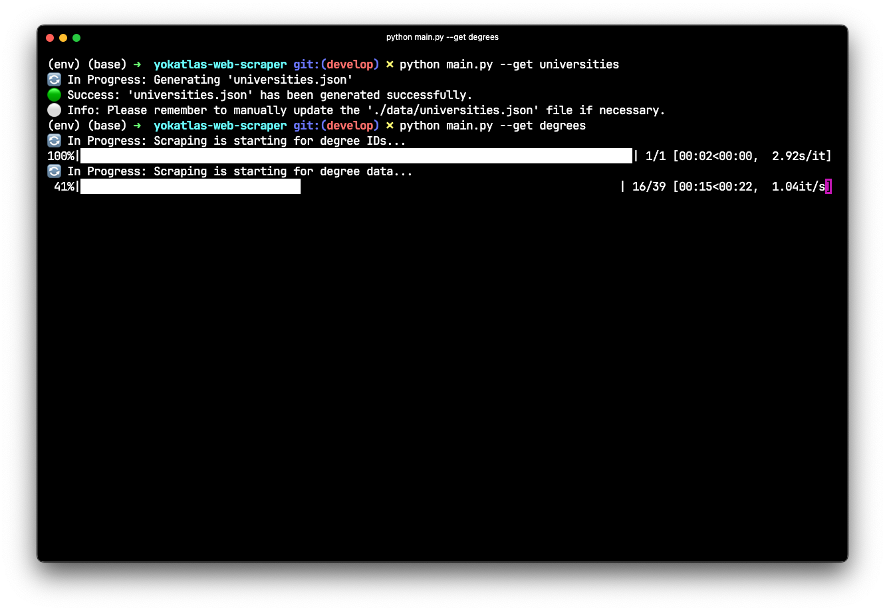
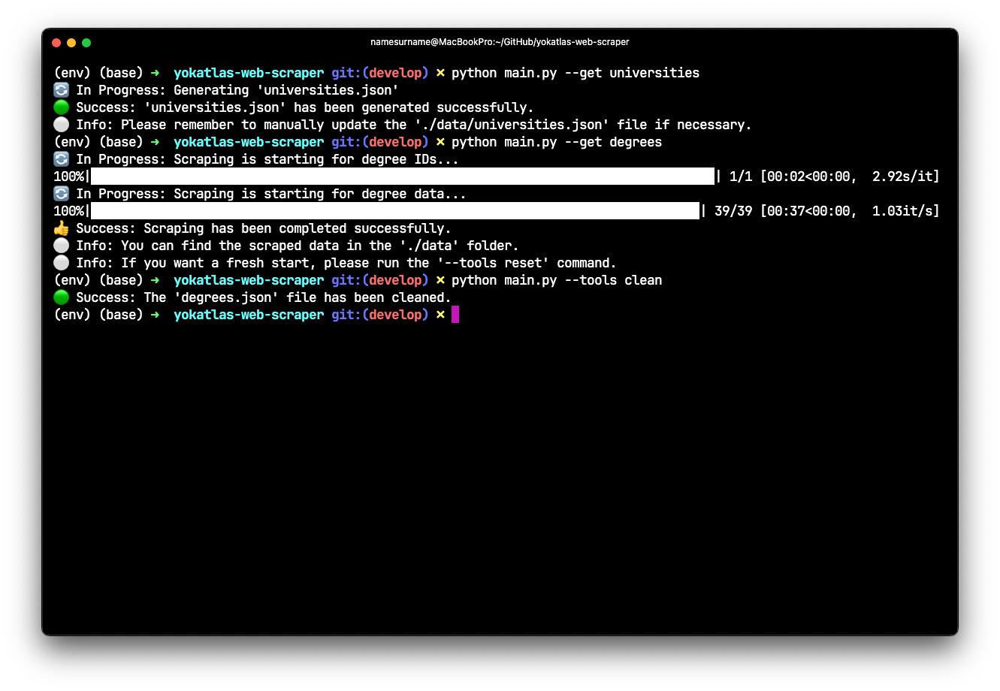
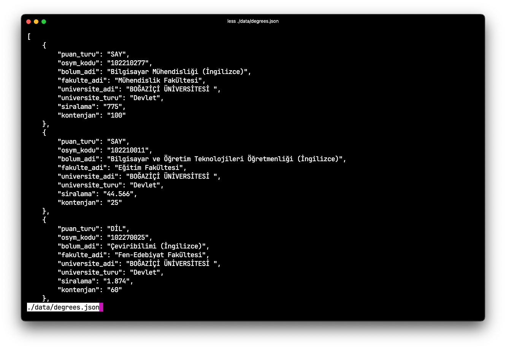

## YokAtlas Web Scraper

- A web scraper using **Python**, **BeautifulSoup** and **Selenium** to extract bachelor's degree program details from Turkish universities.

### 1. Preview

<div style="float: left;">
    
    
    
</div>

### 2. Warning

This project is for `educational use only` and carries no liability.

### 3. Installation

Ensure you have `Python 3.x`, `pip`, `virtualenv` and `chromedriver` installed on your system.

1. **Clone the repository**

```sh
git clone https://github.com/otegecmis/yokatlas-web-scraper.git
```

2. **Navigate to the project directory**

```sh
cd yokatlas-web-scraper
```

3. **Create a virtual environment**

```sh
virtualenv env
```

4. **Activate the virtual environment**

```sh
. env/bin/activate
```

5. **Install the required dependencies**

```sh
pip install -r requirements.txt
```

6. **Run the scraper**

Use the commands from the `Usage` section below. 🥳

### 4. Usage

| Action                                 | Command                             |
| -------------------------------------- | ----------------------------------- |
| Get Universities                       | `python main.py --get universities` |
| Get Degrees                            | `python main.py --get degrees`      |
| Reset the Database                     | `python main.py --tools reset`      |
| Manipulate Data for Clean Operation    | `python main.py --tools clean`      |
| Help                                   | `python main.py --h`                |


